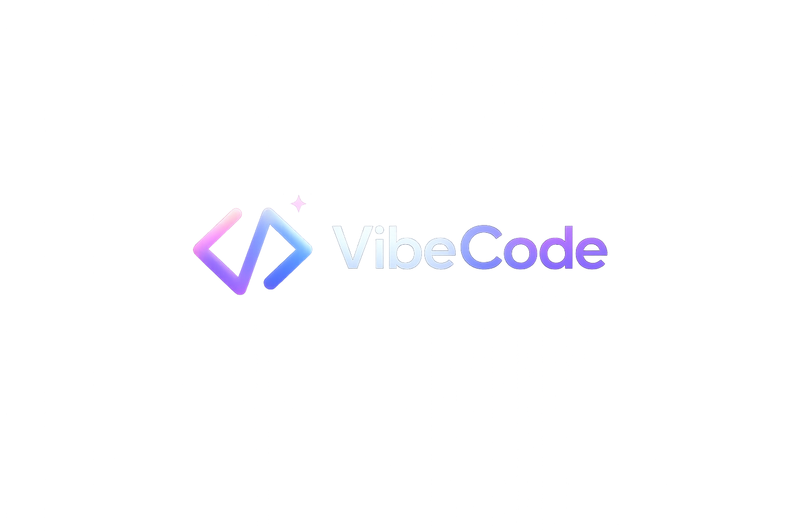
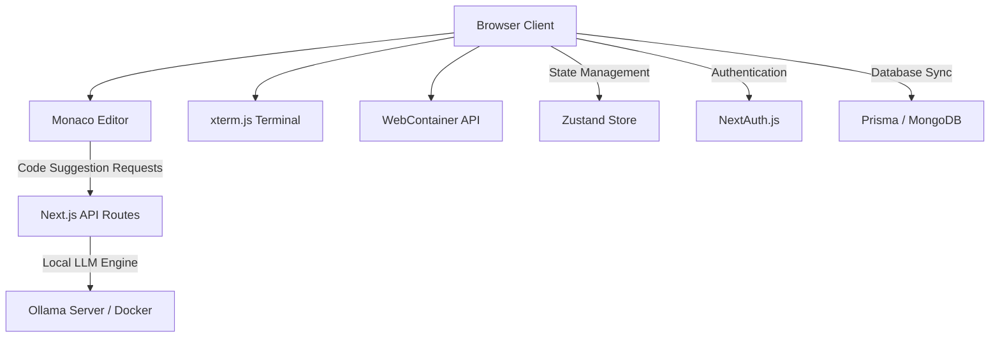

#  Vibecode Editor — AI-Powered Web IDE

[](https://nextjs.org/)
[](https://www.typescriptlang.org/)
[](https://tailwindcss.com/)
[](https://webcontainers.io/)
[](https://ollama.com/)

**Vibecode Editor** is a blazing-fast, next-generation web-based IDE built entirely in the browser. Powered by **Next.js 15**, **WebContainers**, **Monaco Editor**, and **local LLMs via Ollama**, it brings full-stack development right into your browser with zero local environment setup. Run projects, execute commands in an interactive terminal, autocomplete code using local offline models, and chat with an AI assistant—all styled in a premium, developer-first dark theme.


---

## ✨ Features

- ⚙️ **WebContainer Runtime** – Spin up real Node.js micro-environments in seconds inside the browser. Compile, test, and run frontend/backend apps entirely client-side.
- 💻 **Interactive Terminal (xterm.js)** – A full-fledged terminal experience linked directly with your WebContainer instance. Run commands like `npm i`, `npm run dev`, or start local servers.
- 💡 **Offline AI Autocomplete (Ollama)** – Leverage local models (like `codellama`) for context-aware code completion. Trigger with `Ctrl + Space` or double `Enter`, and accept with a simple `Tab` key.
- 🤖 **AI Chat Assistant** – A built-in sidebar chat panel allowing you to reference files, debug code, ask for refactors, or request step-by-step explanations.
- 🧱 **Instant Templates** – Start coding immediately with preconfigured starters:
  - React (Vite)
  - Next.js
  - Express.js
  - Vue.js
  - Angular
  - Hono
- 🗂️ **Robust File Explorer** – Create, rename, delete, and manage files/folders dynamically. Changes sync immediately with the browser runtime and your workspace.
- 🌗 **Premium UI & Themes** – Built using Tailwind CSS 4 & ShadCN UI with high-end glassmorphism elements, custom animations, and automated dark mode hydration settings.
- 🔐 **OAuth Auth Integration** – Secure login using NextAuth (supporting Google and GitHub OAuth providers).

---

## 🛠️ Architecture & Tech Stack



| Layer | Technologies Used |
|---|---|
| **Framework** | Next.js 15 (App Router, Server Actions) |
| **Database** | MongoDB & Prisma ORM |
| **Authentication**| NextAuth v5 (Google & GitHub OAuth) |
| **State** | Zustand |
| **In-Browser VM** | `@webcontainer/api` |
| **Code Editor** | `@monaco-editor/react` & Monaco Editor |
| **Terminal** | `xterm.js` with Fit & Search addons |
| **Styling** | Tailwind CSS 4 & ShadCN UI components |

---

## 🚀 Getting Started

### 1. Prerequisites
Ensure you have the following installed on your local machine:
* [Node.js](https://nodejs.org/) (v18.x or higher)
* [Ollama](https://ollama.com/) (For local code completions)
* MongoDB database (local or MongoDB Atlas connection)

### 2. Clone the Repository
```bash
git clone https://github.com/Chiraganand005/AI-Vibe-Code_Editor.git
cd AI-Vibe-Code_Editor
```

### 3. Install Dependencies
```bash
npm install
```

### 4. Setup Environment Variables
Create a `.env` file in the root directory:
```env
# Database URI
DATABASE_URL="mongodb+srv://<user>:<password>@<cluster>.mongodb.net/Vibe-Code-editor?appName=Cluster0"

# Authentication Secrets
AUTH_SECRET="your_nextauth_secret_hash"
NEXTAUTH_URL="http://localhost:3000"

# OAuth Credentials
AUTH_GITHUB_ID="your_github_client_id"
AUTH_GITHUB_SECRET="your_github_client_secret"
AUTH_GOOGLE_ID="your_google_client_id"
AUTH_GOOGLE_SECRET="your_google_client_secret"
```

### 5. Launch the Local AI Engine
Start Ollama on your local machine and pull/run the `codellama` model:
```bash
ollama run codellama
```
*(The editor calls `localhost:11434` behind the scenes to fetch completions.)*

### 6. Run the Dev Server
```bash
npm run dev
```
Open **[http://localhost:3000](http://localhost:3000)** in your browser.

---

## ⌨️ Keyboard Shortcuts

| Shortcut | Action |
|---|---|
| `Ctrl + Space` | Trigger inline AI suggestion manually |
| `Tab` | Accept the displayed AI suggestion |
| `Escape` | Reject/Hide active suggestion |
| `Ctrl + S` | Save current file |
| `Ctrl + Shift + S` | Save all modified open files |

---

## 🤝 Contributing

Contributions are what make the open source community such an amazing place to learn, inspire, and create. Any contributions you make are **greatly appreciated**.

1. Fork the Project
2. Create your Feature Branch (`git checkout -b feature/AmazingFeature`)
3. Commit your Changes (`git commit -m 'Add some AmazingFeature'`)
4. Push to the Branch (`git push origin feature/AmazingFeature`)
5. Open a Pull Request

---

## 📄 License

Distributed under the MIT License. See [LICENSE](LICENSE) for more information.

---

## 🌟 Acknowledgements

* [StackBlitz WebContainers](https://webcontainers.io/) for making browser virtual environments possible.
* [Microsoft Monaco Editor](https://microsoft.github.io/monaco-editor/) for the robust editing foundation.
* [Ollama](https://ollama.com/) for making local offline AI inference developer-friendly.
* [Shadcn UI](https://ui.shadcn.com/) for the gorgeous component primitives.
